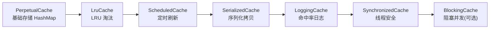
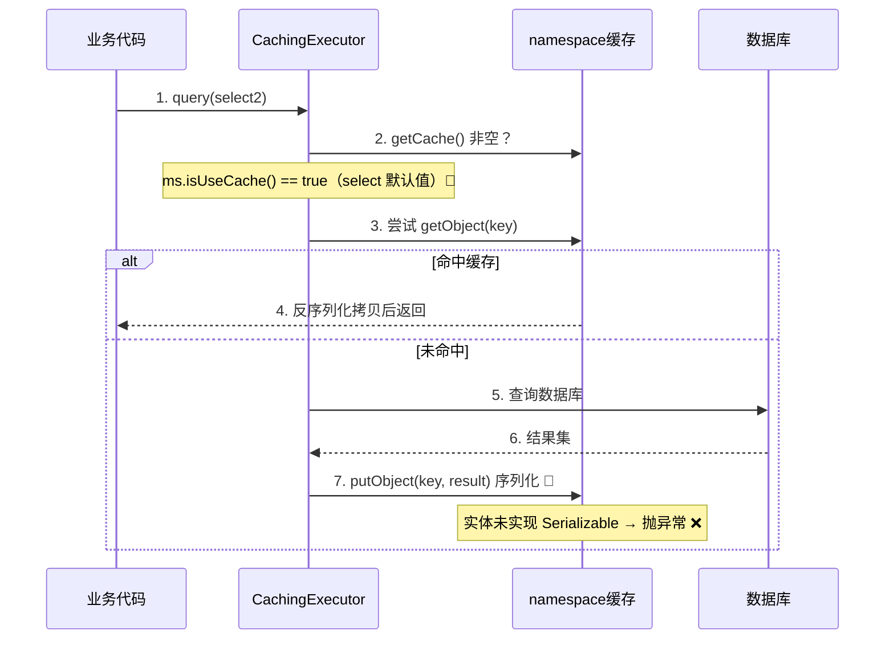

* content
{:toc}

> 优化基础规则数据库的查询过程中，本来想着给部分慢查询启用二级缓存，简单方便。
>
> 结果却造成线上事故：namespace 下的 `<cache>` 配置，让其他**没有声明 `useCache="true"`** 的 select 也默认走了二级缓存，又因为返回值实体类未实现 `Serializable` 抛出序列化异常。
>
> 本文从事故出发，拆解 `<cache>` 标签的装饰器实现、`useCache` 默认值逻辑与二级缓存运行流程，最后给出修复方案与避坑建议。

## 问题场景

### 工程配置

基础规则数据库中有个慢查询 select1，本想通过 Mybatis 二级缓存优化，在 Mapper XML 中声明了 `<cache>`：

```xml
<!-- namespace 级别二级缓存：容量 1000，60 分钟刷新，LRU 淘汰，读写缓存 -->
<cache size="1000" flushInterval="3600000" readOnly="false" eviction="LRU" />

<!-- 启用缓存，优化查询 ① -->
<select id="select1" resultMap="ResultMap1" useCache="true" flushCache="false">
    SELECT * FROM rule_a WHERE id = #{id}
</select>

<!-- 没想启用缓存，且 ResultMap2 对应的实体类没有实现 Serializable ② -->
<select id="select2" resultMap="ResultMap2">
    SELECT * FROM rule_b WHERE biz_code = #{bizCode}
</select>
```

① select1 是目标查询，显式声明 `useCache="true"` 开启二级缓存。

② select2 未声明任何缓存属性，按直觉应该不走缓存。而且其返回值 `ResultMap2` 对应的实体类 `RuleB` **没有实现 `java.io.Serializable`**。

### 异常表现

上线后线上直接报错：

```text
java.io.NotSerializableException: com.foo.model.RuleB
	at java.io.ObjectOutputStream.writeObject0(ObjectOutputStream.java:1184)
	at java.io.ObjectOutputStream.writeObject(ObjectOutputStream.java:348)
	at org.apache.ibatis.cache.decorators.SerializedCache.serialize(SerializedCache.java:51)
```

🙉 select2 明明没有声明 `useCache="true"`，为何也走了二级缓存？还触发了 `SerializedCache` 的序列化逻辑？

## 问题分析

### 疑点①：useCache 默认值

Mybatis 解析 `<select>` 标签时，会读取 `useCache` 属性，注意它的**默认值**：

```java
/**
 * 解析 select/insert/update/delete 语句节点
 * @see org.apache.ibatis.builder.xml.XMLStatementBuilder#parseStatementNode
 */
boolean isSelect = sqlCommandType == SqlCommandType.SELECT;

// flushCache：非 select（增删改）默认 true，select 默认 false
boolean flushCache = context.getBooleanAttribute("flushCache", !isSelect);

// useCache：select 默认 true，非 select 默认 false 🎈
boolean useCache = context.getBooleanAttribute("useCache", isSelect);
```

🎈 **关键发现**：`useCache` 的默认值就是 `isSelect`！

- select 语句：`useCache` 默认 `true` → **只要 namespace 下配置了 `<cache>`，所有 select 天然启用二级缓存**
- 增删改语句：`useCache` 默认 `false`

所以 select2 虽然没有显式声明，但默认 `useCache="true"`，依然走了二级缓存。这就是事故的直接原因 ❌

### 疑点②：序列化异常根因

`<cache>` 的 `readOnly` 默认 `false`（即读写缓存），Mybatis 会为缓存实例包一层 `SerializedCache`：

```java
/**
 * 读写缓存会额外包装 SerializedCache
 * @see org.apache.ibatis.builder.MapperBuilderAssistant#useNewCache
 * @see org.apache.ibatis.cache.CacheBuilder#setStandardDecorators
 */
if (readWrite) {
    cache = new SerializedCache(cache);   // readWrite=true → 序列化拷贝 🎈
}
```

`SerializedCache` 在写入缓存时对对象做序列化，读缓存时反序列化拷贝：

```java
/**
 * 读写缓存写入：对象序列化后存储
 * @see org.apache.ibatis.cache.decorators.SerializedCache#putObject
 */
public void putObject(Object key, Object object) {
    if (object == null || object instanceof Serializable) {
        delegate.putObject(key, object);            // 可直接存储
    } else {
        byte[] bytes = serialize((Serializable) object);  // 序列化拷贝 🎈 未实现 Serializable 在此报错
        delegate.putObject(key, bytes);
    }
}
```

select2 返回的实体 `RuleB` 未实现 `Serializable`，在序列化阶段直接抛异常 ❌

## 相关源码

### ① `<cache>` 标签的实现原理

`<cache>` 标签由 `XMLMapperBuilder#parse` 解析，最终通过 `MapperBuilderAssistant#useNewCache` + `CacheBuilder#build` 构建出**装饰器链**：



各层装饰器职责与触发条件：

| 装饰器 | 职责 | 触发条件 |
|---|---|---|
| `PerpetualCache` | 基础存储，底层 `HashMap` | 始终存在 |
| `LruCache` | LRU 淘汰 | `eviction` 默认 `LRU` |
| `ScheduledCache` | 定时清空 | 配置了 `flushInterval` |
| `SerializedCache` | 序列化/反序列化拷贝 | `readOnly="false"`（默认） |
| `LoggingCache` | 命中率统计日志 | 始终存在 |
| `SynchronizedCache` | 方法加锁，线程安全 | 始终存在 |
| `BlockingCache` | 未命中时阻塞并发请求 | `blocking="true"` |


### ② 二级缓存运行流程

查询时由 `CachingExecutor#query` 判断 namespace 是否有缓存：

```java
/**
 * 二级缓存查询入口
 * @see org.apache.ibatis.executor.CachingExecutor#query
 */
Cache cache = ms.getCache();                  // ① namespace 是否有 <cache>
if (cache != null) {
    flushCacheIfRequired(ms);                 // ② 按 flushCache 决定是否清空
    if (ms.isUseCache() && resultHandler == null) {  // ③ isUseCache() 即 useCache 属性 🎈
        // 命中则返回缓存，否则查库并写入 tcm
    }
}
```



### ③ 序列化缓存存在的意义

🎈 读写缓存（`readWrite=true`）每次返回的都是**序列化拷贝出的新对象**，多线程各自持有一份，避免共享同一引用互相修改产生**脏数据**；而只读缓存（`readOnly=true`）直接返回对象引用，性能更高，但共享同一实例存在被修改的风险。

## 修复与避坑

### 修复方案

- ✔ **方案一**：缓存涉及的实体类统一实现 `java.io.Serializable`，注意关联对象也要实现
- ✔ **方案二**：`<cache readOnly="true">` 声明只读缓存，跳过序列化拷贝
- ✔ **方案三**：对不需要缓存的 select 显式声明 `useCache="false"` 关闭（默认值陷阱，必须显式声明才可关闭）

⭐ 事故根因在于 select 默认 `useCache="true"`：一旦配置 `<cache>`，**所有 select 默认都走二级缓存**，无论是否声明。

### 遗留风险

- 🎈 **脏数据**：只读缓存直接返回对象引用，缓存对象可能被业务代码修改
- 🎈 **序列化要求**：实体类及内部关联对象必须实现 `Serializable`
- 🎈 **数据一致性 / 分布式坑**：多实例部署时各实例缓存漂移、`flushCache` 覆盖不完整导致数据不一致

## 总结

- `<cache>` 配置下，select 语句 `useCache` 默认 `true`，**不声明也会走二级缓存**，这是事故的直接原因。
- 默认 `readOnly="false"`，会包一层 `SerializedCache`，缓存实体必须实现 `Serializable`，否则报 `NotSerializableException`。
- `<cache>` 采用装饰器设计模式构建，各自职责单一、可组合。
- 启用缓存需评估脏数据、序列化要求与分布式数据一致性风险，先小流量验证再全量上线。
