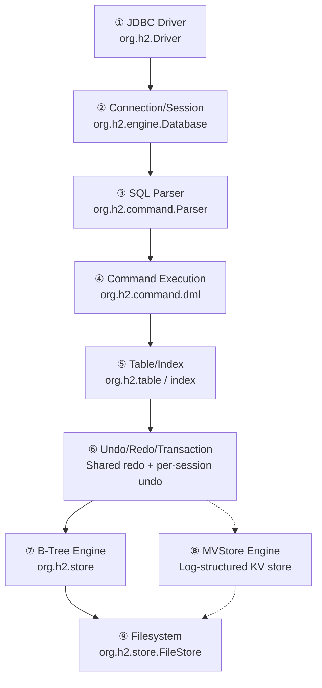

* content
{:toc}

> 本文作为 Code Insight 目录，梳理 h2 数据库的知识点以及感兴趣的实现细节。
> 
> 作为一个教学演示用的数据库，性能优化肯定不是其优势，重点在协议、SQL规范实现的思路和解决方案上。❌
> 
> **h2 数据库提供DBMS 完整的实现、丰富的特性和其简练的实现**，通过了解其设计思路，举一反三，在日常开发设计、MySQL 数据库深度研究都有借鉴意义。✔
> 
> 核心实现的原理分析会持续更新、补充链接。

## 概览🎯

### ①简介

h2 数据库支持嵌入式（开源产品 demo 演示）和服务器模式，可以使用磁盘存储（B 树索引存储引擎、日志结构存储引擎）或内存数据库，并提供事务支持和多版本并发控制（MVCC）。

同时还提供了一个基于浏览器的控制台应用程序（JavaWeb），支持加密数据库和全文搜索（based on Apache Lucene）等扩展特性。功能非常丰富，使用Java 编写，可以作为学习数据库原理和架构的范例。

### ②相关技术点

1. 数据库文件协议实现
2. 磁盘页存储和缓存交互实现
3. SQL 语法解析器（递归下降分析器）
4. 搜索算法（B 树、R-Tree、LSM、全文搜索、多维搜索）
5. 数据存储结构实现
6. ACID
7. clustering
8. 快照、checkpoint、MVCC 实现
9. ANSI-SQL89 规范实现
10. SQL Injection
11. JDBC 协议实现
12. TCPServer 实现
13. Http Web Server 实现
14. JSP 协议实现

### ③参考信息

1. [H2 Database 官网](https://h2database.com/html/main.html)

2. [H2 使用教程](https://h2database.com/html/tutorial.html) 10min 带你玩转 H2 数据库 😀

3. [H2 支持的SQL 语法](https://h2database.com/html/grammar.html) 增删改查、存储过程、触发器等，兼容 ANSI-SQL89 规范。

4. [H2 特性介绍和原理](https://h2database.com/html/features.html) Code Insight 主要参考资料
5. [How to 阅读 h2 数据库源码](./2023-10-19-How-to-read-h2database-sourcecode.md)

## 核心实现✨

> 目录结构参考 [官网介绍架构](https://h2database.com/html/architecture.html) 的 Top-down Overview。
> 
> 结合关系型数据库和 DBMS 相关的知识点，理论结合实际，深入理解数据库思想。

### ①JDBC driver.

> `org.h2.Driver` / `org.h2.jdbcx`
> 
> JDBC 客户端 API 层，提供标准 `java.sql.Driver` 实现，支持嵌入式与服务器模式连接。

### ②Connection/session management.

> `org.h2.engine.Database`（根实例）
> 
> `org.h2.engine.SessionInterface` / `Session`（本地） / `SessionRemote`（远程）
> 
> 管理数据库根实例，封装本地会话与远程会话的差异，处理连接生命周期和并发控制。参考 Database URL Overview 了解 URL 连接和配置示例。

### ③SQL Parser.

> `org.h2.command.Parser`
> 
> SQL 语法解释器使用递归下降分析器（recursive-descent），按照语法规则解析输入的文本。有性能问题，优点是易于实现和理解。

### ④Command execution and planning.

> `package org.h2.command.dml` / `org.h2.command.ddl`
> 
> `org.h2.expression.Expression`
> 
> h2 没有生成查询 IR（中间表示）这一中间步骤，而是直接生成一个命令执行对象。然后对命令对象进行一些优化步骤（`org.h2.expression.Expression#optimize`），生成更有效的命令。

相关文章：
- [Insight H2 database auto increment](./2022-12-02-Insight-H2-database-auto-increment.md)
- [Insight H2 database 数据查询核心原理](./2023-09-14-Insight-H2-database-Select-Structure.md)
- [Insight h2database 执行计划与选择性](./2023-09-18-Insight-h2database-execution-plan-and-Selectivity.md)
- [Insight h2database SQL like 查询](./2023-10-07-Insight-h2database-SQL-like-Statement.md)

### ⑤Table/Index/Constraints.

> `org.h2.table.RegularTable`
> 
> `org.h2.mvstore.db.MVTable`
> 
> `org.h2.index.PageBtreeIndex`
> 
> RegularTable 采用常用的数据表实现方案，使用 B-Tree 索引结构，聚集索引数据存储等。
> 
> MVTable 是基于新一代的存储引擎 MVStore 实现的数据表实现。
> 
> 🎈 索引在 H2 内部作为特殊类型的表存储。

相关文章：
- [H2 数据库 MVStore 与 Regular 存储引擎对比](./2026-07-03-h2-mvstore-vs-regular-storage.md)
- [Insight h2database Regular Table 传统存储引擎 MVCC 实现原理](./2023-12-29-Insight-h2database-MVCC.md)

### ⑥Undo log, redo log, and transactions layer.

> **undo log**：每个会话独立的撤销日志，用于回滚操作或撤销失败的更改，通常以内存中的操作列表形式维护。
> 
> **redo log（transaction log）**：所有会话共享的重做日志，用于在崩溃后恢复数据库。
> 
> 在 MVStore 引擎中，不再需要独立的 undo log 机制。

相关文章：
- [Insight h2database 更新、读写锁以及事务原理](./2023-10-08-Insight-h2database-update-execute-locks-transaction.md)

### ⑦B-tree engine and page-based storage allocation.

> `org.h2.store`
> 
> 基于 B-tree 的存储引擎，按页（通常 2 KB）分配磁盘存储，B-tree 组织数据以实现快速检索和更新。
> 
> B树是一种树状数据结构，用于组织和存储数据，可用于在大量数据集中快速查找和访问数据。针对磁盘存储介质，实现数据快速检索和更新。

相关文章：
- [笔记 h2database BTree 设计实现与查询优化思考](./2023-06-06-Note-BTree-In-h2database.md)

### ⑧MVStore storage engine

> MVStore 是一种持久化的、基于日志结构的键值存储。用作新版本 H2 的默认存储引擎。
> 
> H2 数据库官网特有一章节用来描述 [MVStore](https://h2database.com/html/mvstore.html)。
> 
> 这种引擎将修改的数据缓存在内存中，然后在累积足够的修改后，将它们一次性写入磁盘。这种方式可以提高写入性能，特别是对于不支持小随机写入的文件系统和存储系统（如Btrfs），以及SSD。
> 
> 每个修改集合称为一个“chunk”，其中包含了所有被修改的B树的父节点和根节点，以及元数据。
> 
> 为了重用磁盘空间，会压缩具有最少活动数据的chunk。与传统存储引擎相比，这种引擎更简单、更灵活，并且通常需要更少的磁盘操作。

### ⑨Filesystem abstraction.

> `org.h2.store.FileStore`
> 
> `org.h2.mvstore.OffHeapStore`
> 
> 文件系统抽象层，对随机访问文件存储进行抽象，使内存、磁盘、zip 文件等存储介质对上层表现一致。封装了 seek、readFully、write、sync 等方法，屏蔽了具体存储（也可以使用堆外存储）的实现细节。
> 
> `ByteBuffer.allocateDirect`
