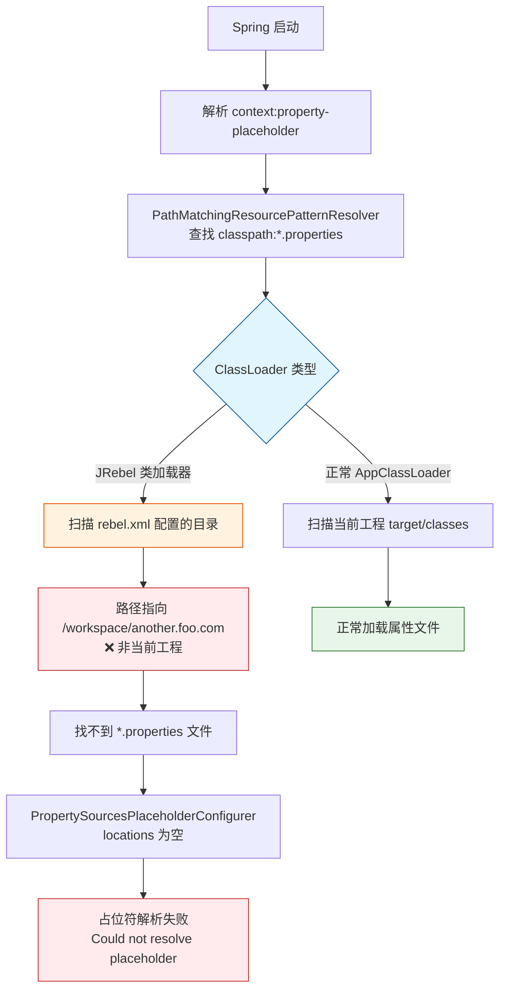

* content
{:toc}

> 在使用 Idea 开发Spring 应用过程中，突然有一次应用启动报错：Could not resolve placeholder 'mq.address' in value "${mq.address}"
> 
> 由此开始此次的源码阅读和异常分析。
> 
> 最后追踪分析是 **JRebel 类加载器的作用机制** 导致的异常。

## 异常场景

### 工程配置

Spring Boot 配置

```java
@ImportResource({
        "classpath:spring/spring-mq-producer.xml",
        "classpath:spring/spring-bean.xml",
})
@PropertySource(value = "classpath:important.properties", encoding = "utf-8")
@Slf4j
public class WebApplication extends SpringBootServletInitializer {
}
```

spring-bean.xml 文件配置

```xml
<!-- 以通配符的形式引入属性文件 -->
<context:property-placeholder location="classpath:*.properties"/>
```

### 异常表现

通过 @PropertySource 配置的属性可以解析并替换占位符✔

通过 context:property-placeholder 配置的属性解析不到，直接报错❌

## 场景复现

```java
// demo: resolver 查找类路径文件的过程。
// 问题复现：需要在当前工程中引入异常的jrebel.xml, 使用JRebel 启动。⭐
public static void main(String[] args) {
	PathMatchingResourcePatternResolver resolver = new PathMatchingResourcePatternResolver();

	try {
		// 查找类路径下的所有 *.properties 文件
		Resource[] resources = resolver.getResources("classpath:*.properties");
		printResources("classpath:*.properties", resources);
	} catch (IOException e) {
		e.printStackTrace();
	}
}
```

## 问题分析

根据相关源码，初步定位在 `PropertySourcesPlaceholderConfigurer` setLocations 初始化时，注入的文件是空的，导致无法成功引入属性文件。

进一步 debug 定位分析，发现 ClassLoader#getResource 过程中，classpath 路径不是当前工程的。

👉通过分析 classpath 相关jar,  发现依赖的 jar 包含 rebel.xml 文件。JRebel会根据`rebel.xml`配置文件中的 classpath 配置扫描指定的目录和 JAR 文件。

这样，查找文件不是当前工程目录(/workspace/another.foo.com/target/classes)，肯定找不到配置文件。

JRebel 类加载器与 Spring 属性解析的冲突流程如下：




### 配置文件实例化

核心方法：org.springframework.core.io.support.PathMatchingResourcePatternResolver#findPathMatchingResources

作用：把 `classpath:*.properties` 字符串解析并映射为具体的文件对象集合

也就是，从 ClassPathResource 转为 FileSystemResource 对象集合

规则：Find all resources that match the given location pattern via the Ant-style PathMatcher.

### 配置文件搜索

核心方法：org.springframework.core.io.support.PathMatchingResourcePatternResolver#doFindPathMatchingFileResources

作用：在文件系统中查找与匹配符合 Ant 正则表达式的所有资源。

### ClassLoader 查找资源文件

核心方法：java.lang.ClassLoader#getResource

作用：在类路径中找到的指定资源。

JDK 的类加载器实现

sun.misc.Launcher.AppClassLoader#getAppClassLoader


## 相关源码

### property-placeholder 解析

使用 PropertyPlaceholderBeanDefinitionParser 解析 `<context:property-placeholder/>`

```java
public class ContextNamespaceHandler extends NamespaceHandlerSupport {

    @Override
    public void init() {
       registerBeanDefinitionParser("property-placeholder", new PropertyPlaceholderBeanDefinitionParser());
    }
}
```

### location 配置解析和实例化

org.springframework.core.io.support.ResourceArrayPropertyEditor

通过 setValue 方法，自动把字符串配置转换为 `Resource` 数组。

配置支持Ant风格的正则表达式，类似：`classpath:*.properties`

### UrlResource 解析

org.springframework.core.io.DefaultResourceLoader#getResource

根据给定的资源位置返回相应的资源对象。如果位置值是一个 URL，则返回 `UrlResource`；如果是非 URL 路径或者是以 "classpath:" 开头的伪 URL，则返回 `ClassPathResource`

### 占位符配置属性替换

org.springframework.context.support.PropertySourcesPlaceholderConfigurer#postProcessBeanFactory

实现替换bean定义中的`${...}`占位符。

## 总结

细节处见真章。

同样的代码，同样的工程配置，在某一时刻发生异常时，要有快速找到问题并能有效规避的能力。
