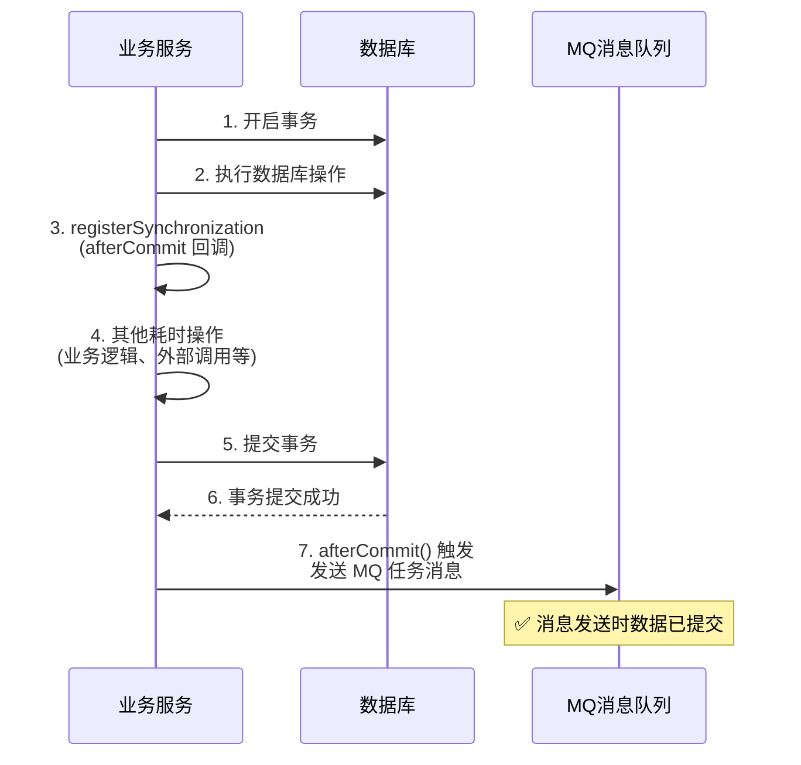

* content
{:toc}

> 业务操作复杂后，发送 MQ 消息和数据库事务往往存在时序错位。事务尚未提交，消息已被消费者处理，导致数据查询失败。
>
> 本文的核心对象是 Spring 的 `TransactionSynchronizationAdapter`，通过注册事务提交回调，以最小代价实现"事务成功后才发送消息"的同步保障。
>
> 关键结论：`TransactionSynchronization` 是单体应用内解决事务与外部交互一致性的轻量级方案，但若涉及主从延迟或网络延迟，则需要更复杂的分布式改造。

## 问题场景

### 异常时序

当业务操作（如创建订单、异常单）和发送 MQ 任务消息**在同一事务中**执行时，如果在事务提交前就发送消息，消息消费者可能立即处理并查询数据库，此时事务还未提交，导致数据不一致。

```java
/**
 * 问题代码示意：事务与消息发送时序错误
 */
@Transactional
public void createOrder(Order order) {
    orderMapper.insert(order);          // 1. 数据库操作
    mqProducer.send(orderMessage);      // 2. 事务未提交，消息已发送 ❌
    // 3. 其他耗时操作（业务逻辑、外部调用等）。消息消费者查询不到新增的数据 ❌
    // 4. 事务提交在此之后
}
```

🙉 消费者收到消息后查询数据库，可能查不到刚插入的数据——因为事务还未提交。

### 问题本质

核心矛盾在于**事务边界与外部交互边界的错位**：

| 阶段 | 消息发送时机 | 消费者查询结果 |
|------|-------------|--------------|
| 事务提交前发消息 | 消息已发送，但数据未提交 | ❌ 查不到数据 |
| 事务提交后发消息 | 数据已提交，消息后发送 | ✅ 正常查询 |

🎈 在单体应用、同库事务场景下，理想的方案是：让消息发送这个"外部交互"延迟到事务真正提交之后。

## 核心方案：TransactionSynchronizationAdapter

### 方案设计

Spring 提供了 `TransactionSynchronization` 接口，允许将自定义逻辑注册到事务生命周期中。其中 `afterCommit()` 回调会在事务成功提交后触发，`afterCompletion()` 则在事务完成（无论成功或失败）后触发。

🎈 选择 `afterCommit()` 而非 `afterCompletion()` 的原因是：只有事务成功提交后才需要发送消息；事务回滚时，数据未落库，不应发送消息。

```java
/**
 * 事务提交后才发送 MQ 消息
 * @see org.springframework.transaction.support.TransactionSynchronizationAdapter
 */
public <T extends MQTaskMessageBaseDto> void sendMQTask(T messageBody) {
    if (TransactionSynchronizationManager.isSynchronizationActive()) {
        log.info("sendMQTask--事务提交后再发送消息:{}", messageBody);
        // 注册事务同步回调，延迟到事务提交后执行
        TransactionSynchronizationManager.registerSynchronization(
                new TransactionSynchronizationAdapter() {
                    @Override
                    public void afterCommit() {
                        doSendMQTask(messageBody);  // 事务已提交，安全发送
                    }
                });
    } else {
        log.info("sendMQTask--直接发送消息:{}", messageBody);
        doSendMQTask(messageBody);  // 无事务上下文，直接发送
    }
}
```

### 执行时序



✔ 这种方案的优势在于**零侵入**——业务代码不需要关心事务状态，统一封装在消息发送层。

### 优点与局限

⭐ 优点：复杂度低，Spring 原生支持; 实现难度低，代码量少

🎈 不足：如果涉及**主从延迟**（消息发送后消费者读从库，数据尚未同步）或**网络延迟**（消息先于事务提交传播到消费者），则需要更复杂的分布式改造方案（如本地消息表、事务消息等）。

## 扩展场景：缓存更新和事务一致性

`TransactionSynchronizationAdapter` 的应用不仅限于 MQ 消息发送。Spring Cache 模块中，`TransactionAwareCacheManagerProxy` 正是基于同样的思想，为缓存操作添加事务感知能力。

### 背景：缓存与事务的脏数据问题

某些缓存管理器（如 `SimpleCacheManager`）不支持直接的事务感知。如果在事务中先更新缓存、后回滚事务，缓存中就会残留脏数据：

```java
@Transactional
public void updateData(Data data) {
    cache.put(data.getId(), data);   // 1. 缓存已更新
    dataMapper.update(data);          // 2. 数据库操作
    // 3. 抛出异常，事务回滚
    // 结果：缓存是新数据，数据库是旧数据 ❌
}
```

### TransactionAwareCacheManagerProxy 的设计

`TransactionAwareCacheManagerProxy` 基于**组合模式**，为不支持事务感知的 `CacheManager` 添加事务同步能力。它本质上是 `TransactionAwareCacheDecorator` 装饰目标 `Cache` 实例，将缓存写操作与 Spring 管理的事务绑定。

```java
/**
 * 事务感知缓存装饰器
 * @see org.springframework.cache.transaction.TransactionAwareCacheDecorator
 */
public class TransactionAwareCacheDecorator implements Cache {
    private final Cache targetCache;

    @Override
    public void put(final Object key, final Object value) {
        if (TransactionSynchronizationManager.isSynchronizationActive()) {
            // 存在活动事务时，延迟缓存写操作到事务提交后
            TransactionSynchronizationManager.registerSynchronization(
                new TransactionSynchronizationAdapter() {
                    @Override
                    public void afterCommit() {
                        targetCache.put(key, value);  // 事务提交后真正写入缓存
                    }
                });
        } else {
            targetCache.put(key, value);  // 无事务，直接写入
        }
    }

    // evict、clear 等操作同理延迟执行
}
```

🎈 核心逻辑与 MQ 发送方案完全一致：存在活动事务时，`put`、`evict`、`clear` 等操作被注册到 `TransactionSynchronizationManager`，延迟到事务成功提交后才真正执行。若事务回滚，这些缓存操作自然失效，不会污染缓存。

✔ 这种装饰器模式的设计非常优雅：**不修改原有缓存管理器的实现**，仅通过代理层增强事务感知能力，符合开闭原则。

## 其他同步方案

在分布式场景或更高可靠性要求下，还有以下方案可供选择：

| 方案 | 复杂度 | 可靠性 | 实现难度 | 适用场景 |
|------|--------|--------|----------|----------|
| **本地消息表** | ⭐⭐⭐ | 高 | 中 | 跨服务 / 跨库场景，需持久化消息 |
| **RocketMQ 事务消息** | ⭐⭐⭐ | 高 | 中 | 已使用 RocketMQ，两阶段提交 |
| **定时扫描补偿** | ⭐⭐ | 中 | 低 | 简单场景，允许最终一致性延迟 |
| **Seata 分布式事务** | ⭐⭐⭐⭐ | 高 | 高 | 强一致性要求，改造代价大 |

🎈 选型建议：单体应用优先使用 `TransactionSynchronization`（本文方案）；跨服务、跨库场景考虑本地消息表或 RocketMQ 事务消息；对一致性要求极高且可接受高改造成本时，再考虑分布式事务框架。

## 总结

- `TransactionSynchronizationAdapter` 是 Spring 原生的事务生命周期钩子，以最小代码量实现"事务提交后执行外部操作"的同步保障。
- 核心模式是**延迟执行**：将非事务性操作（MQ 发送、缓存更新）注册为 `afterCommit` 回调，绑定到事务成功提交后才真正执行。
- `TransactionAwareCacheManagerProxy` 是同一思想的经典应用，通过装饰器模式为缓存添加事务感知，避免事务回滚后的脏数据问题。
- 该方案适用于**单体应用 / 同库事务**场景，实现简单、无额外依赖；若存在主从延迟、网络延迟或跨服务分布式场景，则需升级为本地消息表、事务消息等更复杂的方案。
- 技术选型的原则：在满足可靠性要求的前提下，优先选择**复杂度最低**的方案。⭐
