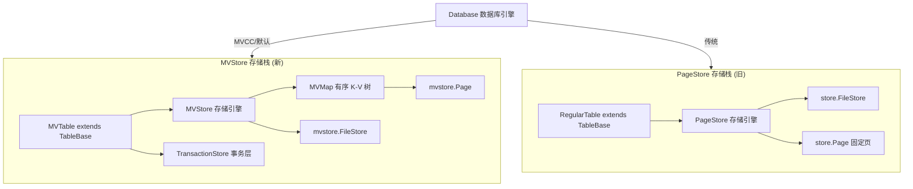
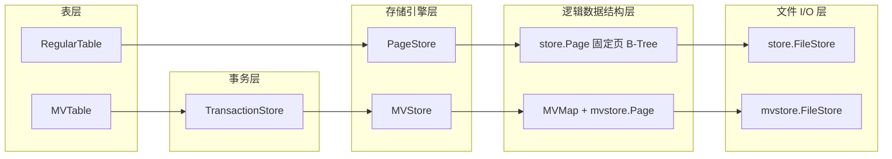

* content
{:toc}

> 在深入阅读 H2 数据库源码时，会发现内部存在**两套完全独立的存储实现**——`MVStore` 和 `PageStore`。
>
> 初次接触时容易混淆：同名类 `FileStore` 为何分布在不同包下？`MVMap` 和 `Page` 又是什么关系？
>
> 本文通过**层级对照**的方式，将两条并行的存储栈拉平对比，帮助建立起清晰的结构认知。`MVStore` 为默认引擎，采用 `MVCC` 机制；`Regular` 对应传统的 `PageStore` 栈。

## 背景

`Database` 在启动时根据配置决定走哪条存储栈，`MVStore` 为当前默认选项：

```java
// @see org.h2.engine.Database#open
// 依据配置 MV_STORE 决定使用哪套引擎
if (dbSettings.mvStore) {
    // 走 MVStore 栈（新）
} else {
    // 走 PageStore 栈（旧）
}
```

🎈 两套栈**互不混用**，表引擎、存储层、文件 I/O 全是独立实现。理解这一点，就不会再把 `org.h2.mvstore.FileStore` 和 `org.h2.store.FileStore` 搞混了。

## 两条并行的存储栈



> ⚠️ **关键点**：`org.h2.mvstore.FileStore` 和 `org.h2.store.FileStore` 是**两个不同的类**，分属两套栈，互不相关。

## 存储实现

### ① MVStore 栈

```java
// MVMap 属于 MVStore
public class MVMap<K, V> {
    MVStore store;
}

// MVStore 管理多个 MVMap
public class MVStore {
    ConcurrentHashMap<Integer, MVMap<?, ?>> maps;
    FileStore fileStore;        // 底层 I/O
    MVMap<String, String> meta; // 元信息 map
}

// MVTable 持有 TransactionStore
public class MVTable extends TableBase {
    TransactionStore store;
    // 主键/索引数据落在若干 MVMap 上
}
```

核心关系：

- `MVMap.store` → 每个 `MVMap` **属于一个** `MVStore`
- `MVStore.maps` → 一个 `MVStore` **管理多个** `MVMap`
- `MVStore.fileStore` → `MVStore` **持有一个** `mvstore.FileStore` 做底层 I/O
- `MVStore.meta` → 特殊的 `MVMap<String,String>` 记录所有 map 的元信息
- `MVTable.store` → `MVTable` **持有** `TransactionStore`，后者包装 `MVStore`

### ② PageStore 栈

```java
// RegularTable 的索引持有 PageStore
public class PageDataIndex extends Index {
    PageStore store;
}

public class PageStore {
    FileStore file;  // store.FileStore，与 mvstore.FileStore 不同
}

// Database 整库共享一个 PageStore 实例
public class Database {
    PageStore pageStore;
}
```

核心关系：

- `RegularTable` 的索引（`PageDataIndex`、`PageBtreeIndex`）**持有** `PageStore`
- `PageStore.file` → `PageStore` **持有一个** `store.FileStore`
- `Database.pageStore` → 整库**共享一个** `PageStore` 实例

## 平行对应关系



### ① 表层

- `RegularTable` vs `MVTable`：均继承 `TableBase`，对应传统表与 MVCC 表。

### ② 事务层

- `MVTable` 通过 `TransactionStore` 支持 `MVCC`；`RegularTable` 直接耦合在 `PageStore` 中，没有独立事务层。

### ③ 存储引擎层

- `PageStore` 和 `MVStore` 是两套核心引擎，分别服务各自的上层表。

### ④ 逻辑数据结构层

- `PageStore` 侧使用 `store.Page` 固定页 `B-Tree`；
- `MVStore` 侧使用 `MVMap`（有序 `K-V` 树），内部节点为 `mvstore.Page`。

### ⑤ 文件 I/O 层

- `store.FileStore` 和 `mvstore.FileStore` 同名不同类，各自只服务本栈。

## 核心差异总结

| 维度 | MVStore 栈 | PageStore 栈 |
|------|-----------|-------------|
| 默认启用 | ✔ 默认 | ❌ 需显式配置 |
| 事务支持 | `MVCC` 多版本并发 | 默认传统锁机制（也可开启 MVCC） |
| 中间层 | `MVMap`（多 `K-V` 树容器） | 无，直接用固定页 `B-Tree` |
| 文件 I/O | `mvstore.FileStore` | `store.FileStore` |
| 表实现 | `MVTable` | `RegularTable` |

🎈 **最关键的区别**：`MVMap` 是 `MVStore` 独有的中间层。`MVStore` 是“多个 `MVMap` 的容器”，每张 `MVTable` 的数据/索引就是若干 `MVMap`；`PageStore` 侧没有这层，直接用固定页 `B-Tree` 索引。

🎈 RegularTable 有完整的 MVCC 事务语义，包括读己之写、隐藏其他事务未提交数据、写写冲突检测、提交与回滚；只是底层仍**受 PageStore 全局同步**与内存 undoLog 的限制，不如 MVTable 的 MVStore 原生 MVCC。

## 总结

- PageStore（传统） 栈：`RegularTable→PageStore→store.FileStore` 
- MVStore 栈实现：`MVTable→(TransactionStore)→MVStore→mvstore.FileStore`
- `MVMap` 是 `MVStore` 独有的中间层，理解这点就能区分两套引擎的核心设计差异
- `FileStore` 同名不同类，各自只服务本栈，是最底层的文件读写封装
