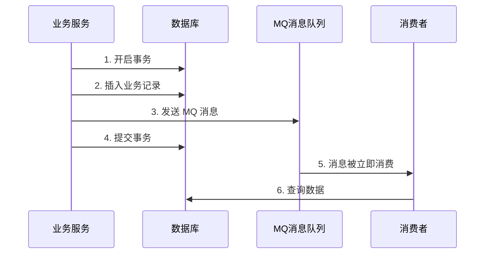
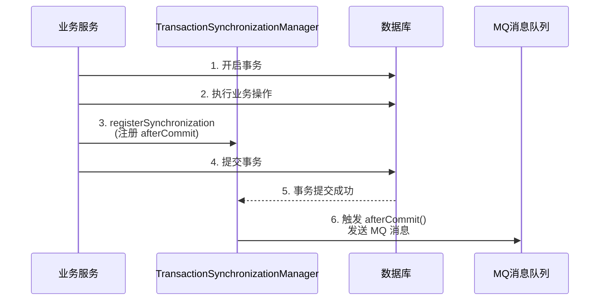
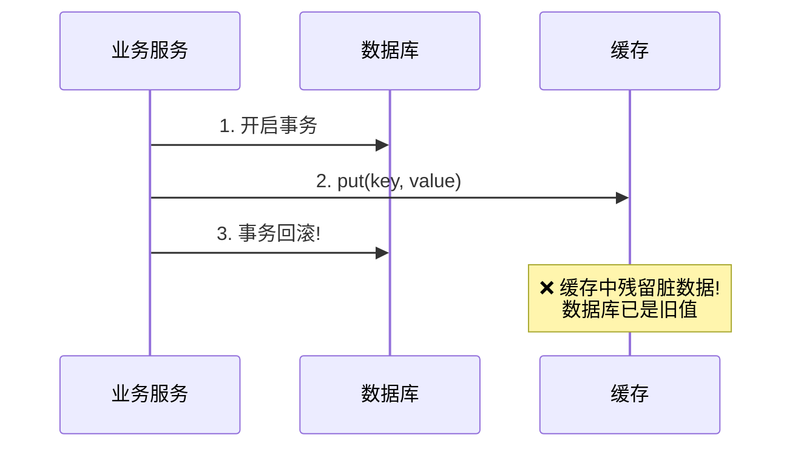

* content
{:toc}

> 在日常业务开发中，经常需要在事务中完成数据库操作后，对外发送 MQ 消息通知下游消费。但在事务提交前就发送消息，消费者可能立即处理并查询数据库，此时事务还未提交，导致数据不一致。
>
> Spring 框架提供了 `TransactionSynchronizationAdapter` 作为最小代价的同步方案，在 `afterCommit()` 回调中执行外部交互，确保消息只在事务成功提交后才发送。
>
> 本文将围绕该机制展开，同时扩展到 `TransactionAwareCacheManagerProxy` 的应用场景，并简要介绍其他同步方案。

## 问题场景

### 异常表现

假设一个典型的业务场景：创建异常单并通知下游系统。



- `❌` 消息在事务提交前发出，消费者查不到刚写入的数据，导致处理异常
- `❌` 如果事务最终回滚，消息已经发出且无法撤回，造成数据不一致

### 问题本质

这是分布式系统中的**事务与外部交互一致性**问题，核心矛盾在于：

| 时序 | 消息发送时机 | 结果 |
|------|-------------|------|
| 事务提交前发消息 | 消息已送达，数据未落库 | ❌ 消费者查不到数据 |
| 事务提交后发消息 | 数据已落库，消息后发送 | ✅ 消费者可正常处理 |

`🎈` 不只 MQ 消息，任何在事务中需要与外部系统交互的场景（缓存更新、文件写入、RPC 调用等）都会面临同样的问题。

## 核心方案：TransactionSynchronizationAdapter

### ① 实现原理

Spring 通过 `TransactionSynchronizationManager` 在事务生命周期中提供多个扩展点，允许注册自定义的同步回调：

| 回调方法 | 触发时机 | 适用场景 |
|----------|----------|----------|
| `afterCommit()` | 事务已提交 | ✅ 发送 MQ、清除缓存 |
| `afterCompletion(int status)` | 事务结束 | 资源清理（区分提交/回滚） |
| `beforeCommit(boolean readOnly)` | 事务提交前 | 最终校验 |
| `beforeCompletion()` | 事务结束前 | 连接释放前的收尾工作 |

`⭐` 核心思路：在 `afterCommit()` 中执行消息发送，利用事务提交后再执行的特性，天然解决消息与数据的时序问题。



- `✔` 消息发送时数据库操作已全部提交
- `✔` 事务回滚时 `afterCommit()` 不会被调用，消息不会错误发送

### ② 代码实现

核心代码如下，通过在方法中判断当前是否存在活动事务，将消息发送注册到 `afterCommit()` 回调：

```java
/**
 * 发送 MQ 任务消息，确保在事务提交后执行
 *
 * @see org.springframework.transaction.support.TransactionSynchronizationAdapter#afterCommit
 */
public <T extends MQTaskMessageBaseDto> void sendMQTask(T messageBody) {
    if (TransactionSynchronizationManager.isSynchronizationActive()) {
        // 存在活动事务 → 注册 afterCommit 回调，延迟到事务提交后发送
        TransactionSynchronizationManager.registerSynchronization(
                new TransactionSynchronizationAdapter() {
                    @Override
                    public void afterCommit() {
                        log.info("事务已提交，发送MQ消息:{}", messageBody);
                        doSendMQTask(messageBody);
                    }
                });
    } else {
        // 不存在事务 → 直接发送
        log.info("无事务上下文，直接发送MQ消息:{}", messageBody);
        doSendMQTask(messageBody);
    }
}

/**
 * 实际执行消息发送
 */
private void doSendMQTask(MQTaskMessageBaseDto messageBody) {
    // 具体的 MQ 发送逻辑
}
```

`🎈` 注意：当 `TransactionSynchronizationManager.isSynchronizationActive()` 为 `false` 时（非事务场景），需要直接发送消息，避免回调永远不被触发。

### ③ 优点与不足

**优点**：

- `✔` Spring 原生支持，无需引入额外依赖
- `✔` 实现简单，代码侵入性低
- `✔` 无额外延迟，消息在事务提交后立即发送

**不足**：

- `❌` 消息发送失败不会影响已提交的事务，需要配合重试或补偿机制
- `❌` 仅适用于单库事务，对分布式事务场景无能为力
- `❌` 如果存在**主从延迟**，消费者可能从从库读取到旧数据，仍会出现短暂不一致
- `❌` 如果存在**网络延迟**（消息到达延迟），需要额外的最终一致性保障

`🙉` 对于主从延迟和网络延迟问题，这不是 `TransactionSynchronizationAdapter` 本身的缺陷，而是分布式系统固有的挑战。简单的 `afterCommit()` 无法感知这些延迟，需要引入更复杂的方案（如本地消息表 + 定时补偿）。

## 扩展应用：TransactionAwareCacheManagerProxy

`TransactionAwareCacheManagerProxy` 是 Spring 基于同样的同步机制，解决**缓存与事务不一致**问题的典型案例。

### ① 问题背景

当使用非事务感知的缓存管理器（如 `SimpleCacheManager`）时，如果先更新缓存再回滚事务：



- `❌` 数据库回滚后数据恢复原值，但缓存中已写入新值，造成脏数据

### ② 实现原理

`TransactionAwareCacheManagerProxy` 基于**组合模式**，通过 `TransactionAwareCacheDecorator` 装饰目标 `Cache` 实例，将缓存写操作与 Spring 事务绑定：

```java
/**
 * TransactionAwareCacheDecorator 核心逻辑（伪代码示意）
 *
 * @see org.springframework.cache.transaction.TransactionAwareCacheDecorator
 */
public class TransactionAwareCacheDecorator implements Cache {

    private final Cache targetCache;  // 被装饰的真实 Cache

    @Override
    public void put(Object key, Object value) {
        if (TransactionSynchronizationManager.isSynchronizationActive()) {
            // 存在活动事务 → 注册 afterCommit 回调
            TransactionSynchronizationManager.registerSynchronization(
                new TransactionSynchronizationAdapter() {
                    @Override
                    public void afterCommit() {
                        targetCache.put(key, value);  // 事务提交后真正写入缓存
                    }
                });
        } else {
            targetCache.put(key, value);  // 非事务场景直接写入
        }
    }

    // ❌ evict、clear 等写操作同样延迟到 afterCommit
}
```

**核心行为**：

| 操作 | 存在活动事务时 | 无事务时 |
|------|---------------|----------|
| `put(key, value)` | 注册到 `afterCommit`，事务提交后才写入 | 立即写入 |
| `evict(key)` | 注册到 `afterCommit`，事务提交后才清除 | 立即清除 |
| `clear()` | 注册到 `afterCommit`，事务提交后才清空 | 立即清空 |
| `get(key)` | 直接读取（读操作不受事务影响） | 直接读取 |

- `✔` 事务回滚 → `afterCommit()` 不会被调用 → 缓存保持旧值，与数据库一致
- `✔` 事务提交 → `afterCommit()` 被调用 → 缓存写入新值，与数据库一致

### ③ 使用方式

通过 `TransactionAwareCacheManagerProxy` 包装已有的 `CacheManager`：

```java
@Bean
public CacheManager cacheManager(CacheManager targetCacheManager) {
    // 包装目标 CacheManager，使其具备事务感知能力
    return new TransactionAwareCacheManagerProxy(targetCacheManager);
}
```

`🎈` 如果使用了 `@EnableCaching` 且配置了 `JCacheCacheManager`、`ConcurrentMapCacheManager` 等非事务感知的实现，建议通过这种方式增强事务一致性。

## 其他同步方案

除了 `TransactionSynchronizationAdapter` 之外，针对事务与外部交互的同步问题，还有以下可选方案：

| 方案 | 核心思路 | 适用场景 | 复杂度 |
|------|----------|----------|--------|
| 本地消息表 | 将消息写入本地数据库表，定时扫描发送 + 确认消费 | 跨服务、需要最终一致性 | ⭐⭐⭐ |
| RocketMQ 事务消息 | 利用 RocketMQ 事务消息机制，回查本地事务状态 | 已使用 RocketMQ 的场景 | ⭐⭐⭐ |
| 定时扫描补偿 | 定时扫描待发送/失败记录，进行补发 | 简单场景、对时效性要求不高 | ⭐⭐ |
| 事件溯源 (Event Sourcing) | 以事件为事实源，状态从事件派生 | 复杂的领域模型 | ⭐⭐⭐⭐ |
| TCC 分布式事务 | Try-Confirm-Cancel 三阶段协议 | 严格的跨服务数据一致性 | ⭐⭐⭐⭐⭐ |

`👉` 方案选型建议：优先从最简单的方式开始。如果只是单库事务中的消息发送或缓存更新，`TransactionSynchronizationAdapter` 是最低成本的选择；当面临跨数据库、跨服务场景时，再考虑本地消息表或 RocketMQ 事务消息等方案。

## 总结

- `TransactionSynchronizationAdapter` 是 Spring 提供的最小代价方案，通过 `afterCommit()` 将外部交互延迟到事务成功提交后，解决消息发送与数据不一致问题
- 除了 MQ 消息发送，`TransactionAwareCacheManagerProxy` 也是基于同样的同步机制，通过装饰模式将缓存写操作绑定到事务生命周期，避免事务回滚后的脏数据
- 任何在事务中的外部交互（MQ、缓存、RPC、文件写入）都应考虑使用事务同步回调来保障一致性
- 该方案无法解决主从延迟、网络延迟等分布式问题，这些场景需要通过本地消息表、定时补偿等更复杂的方案来保障最终一致性
- 方案选型应遵循"最小代价优先"原则，从简单开始逐步升级
