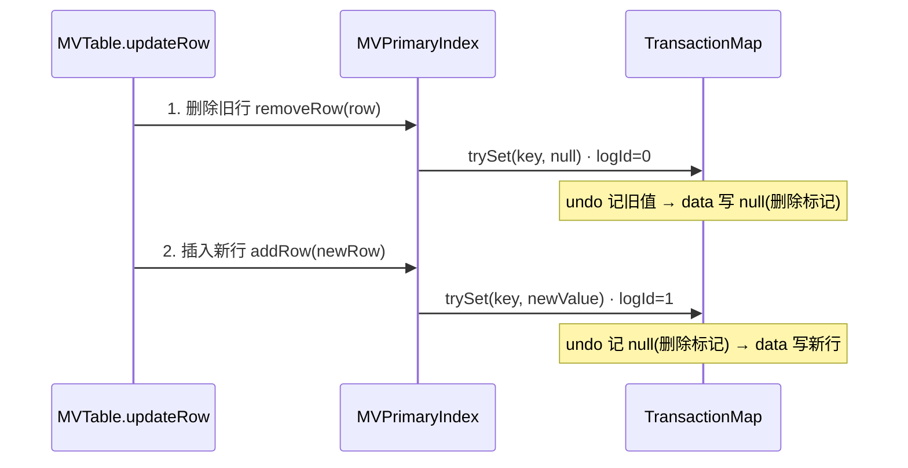

* content
{:toc}

> 上一篇《Insight h2database MVStore Table 新存储引擎 MVCC 实现原理》梳理了 MVTable 的整体架构与可见性机制。
> 
> 本文聚焦 **UPDATE 操作在 MVTable 中的执行细节**。
> 
> 与直觉上的"原地修改某个字段"不同，MVTable 将 UPDATE **拆解为 remove 旧行 + add 新行两步**，每一步都遵循 `trySet` 的"先写 undo、再写数据"。
> 
> 巧妙的是：**undoLog 中每条 `VersionedValue#value` 是前一步 data 的值**，由此 undoLog 串成一条可从最新值回溯到最初已提交版本的单向链。

## 架构速览

先用一张表回顾 MVTable 与 RegularTable 的核心差异：

| 维度 | RegularTable（旧） | MVTable（新/默认） |
|---|---|---|
| 多版本载体 | `row.sessionId` + `row.deleted` | `VersionedValue.operationId` |
| 未提交数据存放 | 内存 delta 集合 | 持久化 `undoLog`（write-ahead） |
| 冲突检测 | 行属性对比 `sessionId` | `trySet` 比对 `operationId` |
| 可见性回溯 | delta 过滤 | `undoLog` 单向链表回溯 |

> 👉 完整对比见《H2 数据库 MVStore 与 Regular 存储引擎对比》

## 核心数据结构：VersionedValue

MVTable 把版本信息编码进每个值自身，而非行对象上：

```java
/**
 * 数据 MVMap 中存储的值，不是裸值，而是带版本的包装
 * @see org.h2.mvstore.db.TransactionStore.VersionedValue
 */
static class VersionedValue {
    public long operationId;  // transactionId(高位) + logId(低位)，0 表示已提交
    public Object value;      // 真正的行数据，null 表示删除标记
}
```

- `operationId == 0` → 已提交，全体事务可见
- `operationId != 0` → 属于某个未提交事务，对其他事务隔离
- **`operationId` 字段，同时承担了隔离（可见性判定）与锁（冲突检测）两个职责。**

## 更新机制：先 undo、再数据

所有写入（Insert / Update / Delete）最终都汇聚到 `trySet`，它是冲突检测的唯一入口：

```java
/**
 * 尝试写入/删除值。若该 key 被其他未提交事务占用，返回 false
 * @see org.h2.mvstore.db.TransactionStore.TransactionMap#trySet
 */
public boolean trySet(K key, V value, boolean onlyIfUnchanged) {
    VersionedValue current = map.get(key);
    VersionedValue newValue = new VersionedValue();
    newValue.operationId = getOperationId(transaction.transactionId, transaction.logId);
    newValue.value = value;

    if (current == null) {
        // ① 全新 key：先写 undo → 再 putIfAbsent
        transaction.log(mapId, key, current);           // undo 存 null
        if (map.putIfAbsent(key, newValue) != null) {
            transaction.logUndo(); return false;
        }
        return true;
    }
    int tx = getTransactionId(current.operationId);
    if (tx == 0) {
        // ② 已有已提交值：先写 undo（旧值） → 再 CAS 覆盖
        transaction.log(mapId, key, current);           // undo 存 旧值
        if (!map.replace(key, current, newValue)) {
            transaction.logUndo(); return false;
        }
        return true;
    }
    if (tx == transaction.transactionId) {
        // ③ 本事务自己改过：允许重入覆盖
        transaction.log(mapId, key, current);
        if (!map.replace(key, current, newValue)) {
            transaction.logUndo(); return false;
        }
        return true;
    }
    // ★ 属于其他未提交事务 → 并发冲突
    return false;
}
```

设计模式（write-ahead 原则）：

⭐ `transaction.log(mapId, key, current)` **总是在数据变更前执行** —— 先把"修改前的值"记入 undoLog，再修改 data MVMap。

## UPDATE 的本质

🎈 MVTable 处理 UPDATE 并不是"原地改一个值"，而是拆成 **两次 `trySet` 调用**，每次对应一个 `logId`：




## undoLog 回溯链

🎈 此为全文最核心的设计：

```
undoLog 单向回溯链：
  bjz (op=operationId_1)
    → 查 undoLog[operationId_1] → oldValue = null (op=operationId_0)
    → 查 undoLog[operationId_0] → oldValue = bjn (op=0, 链尾，已提交)
```

每条 undo 记录的 `VersionedValue#value`（即 `d[2]`），**恰好是上一步 `trySet` 写入 data 的值**。由此 undoLog 自然串成一条**可回溯的单向链**。

```java
/**
 * 可见性回溯：顺 operationId 在 undoLog 中查找"被覆盖前的值"
 * @see org.h2.mvstore.db.TransactionStore.TransactionMap#getValue
 */
VersionedValue getValue(K key, long maxLog, VersionedValue data) {
    while (true) {
        if (data == null) return null;
        long id = data.operationId;
        if (id == 0) return data;                        // 已提交 → 可见
        int tx = getTransactionId(id);
        if (tx == transaction.transactionId) {
            if (getLogId(id) < maxLog) return data;      // 本事务自己的修改 → 可见
        }
        // 其他未提交事务 → 从 undoLog 回溯到上一个版本
        Object[] d = transaction.store.undoLog.get(id);  // d[2] 即 oldValue
        data = (d == null) ? map.get(key) : (VersionedValue) d[2];
        // 循环直到拿到一个可见版本
    }
}
```

🙉 注意：`getValue` 不回走"原始 MVMap"（因 MVStore 是 Copy-on-Write），而是通过 `undoLog` 中记录的 `oldValue(VersionedValue)` 拿到历史版本。**越靠近链尾的值越接近最初状态。**

## 并发场景 Debug SQL

以下用两个浏览器 Session 模拟并发 UPDATE，观察 MVCC 行为：

```sql
-- 建表并初始化数据
CREATE TABLE city (
    id INT(10) NOT NULL AUTO_INCREMENT PRIMARY KEY,
    code VARCHAR(40) NOT NULL,
    name VARCHAR(40) NOT NULL
);
INSERT INTO city VALUES(1, 'bjx', '北京西');
INSERT INTO city VALUES(2, 'bjn', '北京南');
```

```sql
-- Session A：开启事务，更新 id=2
SET AUTOCOMMIT OFF;
UPDATE city SET code = 'bjz' WHERE id = 2;

-- Session A 事务内查询 → 看到 bjz（自己的修改）
SELECT * FROM city WHERE id = 2;
-- 结果: id=2, code='bjz', name='北京南'
```

此时 data MVMap 中 id=2 的值为 `VersionedValue{operationId=txA_log1, value=(2,'bjz','北京南')}`，undoLog 有 2 条记录。

```sql
-- Session B：查询同一条数据 → 通过 undoLog 回溯，仍看到 bjn
SELECT * FROM city WHERE id = 2;
-- 结果: id=2, code='bjn', name='北京南'  → 读到旧版本 ✔

-- Session B：尝试并发更新同一条数据
UPDATE city SET code = 'sjx' WHERE id = 2;
-- ❌ 报错: CONCURRENT_UPDATE_1
```

⭐ 并发流程解读：

| Session B | 底层机制 | 结果 |
|---|---|---|
| `SELECT` | `getValue` 检测到 `operationId` 属于 txA → 顺 undoLog 回溯 → 读到链尾 `bjn(op=0)` | 读到旧值 ✔ |
| `UPDATE` | `trySet` 检测到 `operationId` 属于 txA ≠ txB → 返回 false → 上层抛 `CONCURRENT_UPDATE_1` | 并发冲突 ❌ |

## UPDATE 数据变化演示

demo 演示了同一事务内 UPDATE 的完整状态变化，可逐步查看 undoLog 与 data MVMap 的实时联动：



> 👉 点击"下一步"观察 logId=0（删除旧行）→ logId=1（插入新行）两个阶段中 undoLog 如何逐步增长，以及回溯链 `bjz → null → bjn` 如何形成。
>
> 👉 点击"模拟 COMMIT"观察：operationId 全部置零，undoLog 清空，新值成为已提交版本。

## 提交与回滚机制

### COMMIT

提交的本质：把本事务所有改动值的 `operationId` 清零，并清空 undoLog：

```java
/**
 * @see org.h2.mvstore.db.TransactionStore#commit
 */
void commit(Transaction t, long maxLogId) {
    for (long logId = 0; logId < maxLogId; logId++) {
        Long undoKey = getOperationId(t.getId(), logId);
        Object[] op = undoLog.get(undoKey);
        MVMap<Object, VersionedValue> map = openMap((Integer) op[0]);
        Object key = op[1];
        VersionedValue value = map.get(key);
        if (value.value == null) {
            map.remove(key);              // 删除标记 → 物理删除
        } else {
            VersionedValue v2 = new VersionedValue();
            v2.value = value.value;       // operationId 归零 → 全局可见
            map.put(key, v2);
        }
        undoLog.remove(undoKey);          // 清理 undo
    }
    endTransaction(t);
}
```

### ROLLBACK

回滚从大 `logId` 向小 `logId` 倒序遍历 undoLog，用 `oldValue` 逐级还原：

```java
/**
 * @see org.h2.mvstore.db.TransactionStore#rollbackTo
 */
// 遍历本事务的 undoLog，把每个 key 恢复成 oldValue
// 新增的删掉，修改/删除的还原
```

对于上例的 UPDATE（bjn → bjz）：
1. 取 `undoLog[operationId_1]` → 还原为 `null(op=operationId_0)`
2. 取 `undoLog[operationId_0]` → 还原为 `bjn(op=0)`

逐级逆向走完这条链，data 回到最初状态，如同 UPDATE 从未发生。

## 总结

- MVTable 的 UPDATE **不是原地修改**，而是拆成 **remove 旧行 + add 新行** 两次 `trySet`，每次对应一个 `logId`。
- `trySet` 遵循 **write-ahead 原则**：每条数据写入前，先 `transaction.log()` 把旧值记入 undoLog，保证崩溃后可恢复。
- undoLog 中每条 `VersionedValue#value` 恰好是**前一步 data 的值**，自然形成 `bjz → null → bjn` 的单向回溯链，`getValue` 通过遍历此链实现多版本读。
- 并发冲突检测在 `trySet` 中通过比对 `operationId` 实现：若目标值属于其他未提交事务即返回 false，上层转为 `CONCURRENT_UPDATE_1`。
- undoLog 作为持久化的 MVMap，兼顾了回滚、快照回溯和崩溃恢复，与 MVStore 的 Copy-on-Write 特性天然契合。
