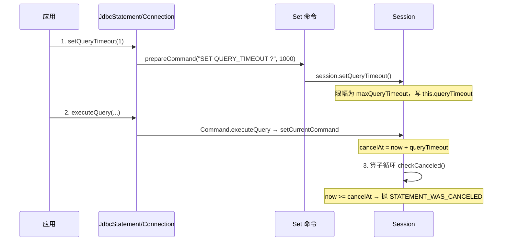

* content
{:toc}

> 交互式查询场景中，一条慢 SQL 可能长时间占用数据库连接，把整个系统拖垮。`Statement.setQueryTimeout` 可以作为保护手段：**快速失败，而不是无限等待**。
>
> 但"取消"到底由谁执行、如何执行，不同数据库差异很大。**H2 是服务端协作式取消，MySQL 是客户端监控线程 + KILL QUERY**。
>
> 最后结合 MyBatis 的 `defaultStatementTimeout` 配置，看超时时间怎么发货作用。

## 业务背景

- 交互式查询（如管理后台、报表）对响应时间敏感，超时设置让慢 SQL **快速失败**，把错误及时暴露给用户。
- 若不加超时，慢 SQL 会长时间占用连接与锁，**拖垮整个系统**，甚至引发雪崩。
- `Statement.setQueryTimeout(int seconds)` 是 JDBC 标准的超时入口，但落地方式因数据库而异。

## H2 实现：服务端协作式取消

> H2 把超时实现为一条 `SET` 命令，执行期间由算子循环周期性调用 `checkCanceled()` 检查是否到期。
>
> 🎈 **协作式（cooperative）**的取消：依赖代码主动检查，一个长循环若没有检查点，可以"绕过"超时。

### ①超时设置链路

`setQueryTimeout` 并不是直接给 Statement 存个值，而是通过 JDBC 下发一条 SQL 命令 `SET QUERY_TIMEOUT ?`：



调用链上的关键类：

```java
/**
 * JDBC 层入口：秒转毫秒，以 SET QUERY_TIMEOUT 命令下发
 * @see org.h2.jdbc.JdbcStatement#setQueryTimeout
 * @see org.h2.jdbc.JdbcConnection#setQueryTimeout
 */
// JdbcStatement.setQueryTimeout(seconds) → JdbcConnection.setQueryTimeout(seconds * 1000)
// → prepareCommand("SET QUERY_TIMEOUT ?", ...) → Set.update() → session.setQueryTimeout
```

```java
/**
 * 最终写入 session.queryTimeout（毫秒），并做全局限幅
 * @see org.h2.engine.Session#setQueryTimeout
 */
public void setQueryTimeout(int queryTimeout) {
    // 取数据库全局配置，session 级不能超过它
    int max = database.getSettings().maxQueryTimeout;
    if (max != 0 && (max < queryTimeout || queryTimeout == 0)) {
        queryTimeout = max;   // 超限 → 按全局上限收口
    }
    this.queryTimeout = queryTimeout;
}
```

🎈 H2 的 `setQueryTimeout` 作用于**当前 Session**，且受全局配置 `maxQueryTimeout` 限幅。

### ②执行期取消：cancelAt + checkCanceled

执行查询时先记录"取消截止时间点"，供算子循环周期检查：

```java
/**
 * 执行前：session.setCurrentCommand 计算 cancelAt = now + queryTimeout
 * @see org.h2.command.Command#executeQuery
 * @see org.h2.engine.Session#setCurrentCommand
 */
session.setCurrentCommand(this);
// 若 queryTimeout > 0 → cancelAt = 当前时间 + queryTimeout
```

```java
/**
 * 周期性检查：now >= cancelAt 则中断查询
 * @see org.h2.engine.Session#checkCanceled
 */
public void checkCanceled() {
    long now = getCurrentTimeNanos();
    if (cancelAt != 0 && now >= cancelAt) {
        throw DbException.get(ErrorCode.STATEMENT_WAS_CANCELED);
    }
}
```

🙉 **协作式取消的代价**：取消依赖算子代码主动调用 `checkCanceled()`。若某段代码是一个不含检查点的长循环（如纯 CPU 计算、大结果集组装），超时期间不会被中断，只能等它自然结束。

## MySQL 驱动实现：监控线程 + KILL QUERY

> MySQL 与 H2 思路完全相反：**客户端**驱动在发起查询前启动一个监控定时任务，超时后另开连接执行 `KILL QUERY` 中断服务端。

### ①启动监控任务

```java
/**
 * 发起查询前，若启用且设置了超时，调度一个取消任务
 * @see com.mysql.jdbc.StatementImpl#executeQuery
 */
if (locallyScopedConn.getEnableQueryTimeouts()
        && this.timeoutInMillis != 0
        && locallyScopedConn.versionMeetsMinimum(5, 0, 0)) {
    timeoutTask = new CancelTask(this);
    locallyScopedConn.getCancelTimer().schedule(timeoutTask, this.timeoutInMillis);
}
```

- `timeoutInMillis` 由 `setQueryTimeout(seconds)` 提前换算好（`seconds * 1000`）。
- 定时器到点后触发 `CancelTask`，其内部再**另起线程**执行取消。

### ②CancelTask：KILL QUERY

`CancelTask` 继承 `TimerTask`，到点后 `run()` 内再启动一个取消线程，核心逻辑二选一：

```java
/**
 * 超时取消：要么直接杀连接，要么另开连接执行 KILL QUERY
 * @see com.mysql.jdbc.StatementImpl.CancelTask#run
 */
if (connection.getQueryTimeoutKillsConnection()) {
    // ① 配置 queryTimeoutKillsConnection=true → 直接关闭连接
    toCancel.wasCancelled = true;
    toCancel.wasCancelledByTimeout = true;
    connection.realClose(false, false, true, new MySQLStatementCancelledException(...));
} else {
    // ② 默认：复制连接属性，另开连接执行 KILL QUERY
    cancelConn = connection.duplicate();   // URL 已变则回退 DriverManager.getConnection
    cancelStmt = cancelConn.createStatement();
    cancelStmt.execute("KILL QUERY " + connectionId);
    toCancel.wasCancelled = true;
    toCancel.wasCancelledByTimeout = true;
}
```

⭐ 关键点：

- 取消用 `KILL QUERY <connectionId>`（注意是 `QUERY` 而非 `CONNECTION`），只中断当前查询，**不杀掉整个会话**。
- 取消发生在**独立监控线程**上，主线程阻塞在 `execSQL` 等服务端响应，收到中断后抛 `MySQLTimeoutException`。
- 复制连接优先用 `connection.duplicate()`；若原连接 URL 已变化，回退 `DriverManager.getConnection(origConnURL, origConnProps)` 重建连接。
- 配置 `queryTimeoutKillsConnection=true` 时不再发 KILL QUERY，直接关闭连接，手段更激进。

## 两种方案对比

| 维度 | H2 | MySQL 驱动 |
|---|---|---|
| 取消发起方 | 服务端（执行算子循环） | 客户端（监控定时任务） |
| 取消方式 | 协作式检查 `checkCanceled()` | 新连接执行 `KILL QUERY` |
| 取消粒度 | 查询内部检查点 | 服务端线程级中断 |
| 盲区 | 无检查点的长循环可"绕过" | 服务端无响应时监控任务徒劳 |
| 额外开销 | 无 | 每次超时需新建连接执行 KILL |

## MyBatis 应用：defaultStatementTimeout

超时配置最常见的落点之一是 MyBatis，全局配置：

```xml
<configuration>
    <settings>
        <!-- 数据库查询/更新执行超过 5 秒仍未响应则超时 -->
        <setting name="defaultStatementTimeout" value="5"/>
    </settings>
</configuration>
```

创建 Statement 后，MyBatis 统一把超时值透传给 JDBC：

```java
/**
 * 设置 Statement 超时：优先 MappedStatement 级别，其次全局默认
 * @see org.apache.ibatis.executor.statement.BaseStatementHandler#setStatementTimeout
 */
protected void setStatementTimeout(Statement stmt) throws SQLException {
    Integer timeout = mappedStatement.getTimeout();
    if (timeout != null) {
        stmt.setQueryTimeout(timeout);      // ① MappedStatement 级别
        return;
    }
    Integer defaultTimeout = configuration.getDefaultStatementTimeout();
    if (defaultTimeout != null) {
        stmt.setQueryTimeout(defaultTimeout);   // ② 全局默认
    }
}
```

🎈 优先级：`MappedStatement.getTimeout()` > `configuration.getDefaultStatementTimeout()` > 不设置。

## 总结

- 落地方式差异巨大：**H2 走服务端协作式取消**（`SET QUERY_TIMEOUT` + `checkCanceled()`），**MySQL 走客户端监控线程 + `KILL QUERY`**。
- H2 的协作式取消依赖算子主动检查，**无检查点的长循环可以绕过超时**；MySQL 的取消独立于主线程，但依赖网络可达与连接复制。
- MyBatis 通过 `defaultStatementTimeout` 将超时统一透传到 JDBC，实现"一处配置、全局生效"。
- 交互式查询场景务必配置合理超时，让慢 SQL **快速失败**，避免连接与锁被长期占用。
